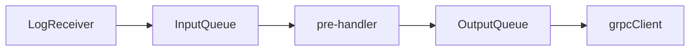

# Arktouros架构设计

## Collector

```mermaid
graph LR
	LogReceiver --> InputQueue
	InputQueue --> pre-handler
	pre-handler --> OutputQueue
	OutputQueue --> grpcClient
```

LogReceiver， Pre-handler 和 grpcClient应该运行在三个独立的线程上