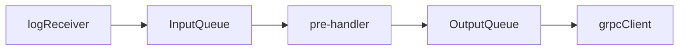

# Arktouros架构设计

本项目中的所有组件都应该是能扩展的

## Collector

LogReceiver， Pre-handler 和 grpcClient应该运行在三个独立的线程上

+ LogReceiver用于接收日志

+ pre-handler用于日志的预处理

+ grpcClient用于发送日志

对于本次项目而言

+ LogReceiver需要完成对日志文件的读取

+ pre-handler需要对日志进行处理，保证发送的数据是otel对象

+ grpcClient用于发送日志
