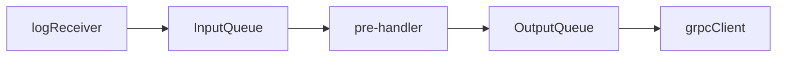
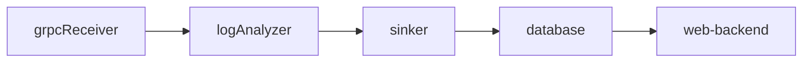

# Arktouros架构设计

本项目中的所有组件都应该是能扩展的

## Collector

LogReceiver， Pre-handler 和 grpcClient应该运行在三个独立的线程上

+ LogReceiver用于接收日志

+ pre-handler用于日志的预处理

+ grpcClient用于发送日志

对于本次项目而言

+ LogReceiver需要完成对日志文件的读取

+ pre-handler需要对日志进行处理，保证发送的数据是otel对象

+ grpcClient用于发送日志

## APM

APM模块是数据处理的核心部分

grpcReceiver接收到来自Collector的序列化的LogsData, MetricsData以及TraceData

logAnalyzer在本项目是一个可有可无的环节 在skywalking里主要负责处理数据，把三种数据转换成skywalking的自有格式

sinker持久化部分，目前暂时也只打算做H2和ElasticSearch，这部分可以用工厂模式https://www.runoob.com/design-pattern/factory-pattern.html

database，如上所述，只打算做H2和ElasticSearch

视web-backend的复杂程度决定是单起一个module还是和apm合并
